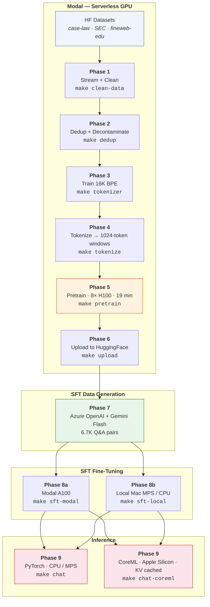

# SLM-125M

**A 125M-parameter language model trained from scratch on legal and financial text — data cleaning through on-device inference — for under $15.**

[](https://opensource.org/licenses/Apache-2.0)
[](https://python.org)
[](https://huggingface.co/Saliltrehan7/slm-125m-base)
[](https://modal.com)

---

## Why This Exists

Most LLM tutorials stop at fine-tuning someone else's model. This project builds one from raw data:

- **From-scratch pretraining** on 2.04B tokens of curated legal/financial text (8x H100, 19 min)
- **Supervised fine-tuning** with synthetically generated Q&A pairs, trainable on a Mac
- **On-device inference** via CoreML with KV-cached decoding at 56 tok/s on Apple Silicon
- **Fully reproducible** — every phase scripted, every cost tracked, total spend ~$15

---

## Model

|                         |                                         |
| ----------------------- | --------------------------------------- |
| Architecture            | LLaMA (decoder-only transformer)        |
| Parameters              | 125.8M (tied embeddings)                |
| Layers / Hidden / Heads | 12 / 768 / 12 (MHA, head dim 64)        |
| FFN                     | SwiGLU, 3,072 intermediate              |
| Context length          | 1,024 tokens                            |
| Vocabulary              | 16,384 (byte-level BPE, custom-trained) |
| Positional encoding     | RoPE (theta = 10,000)                   |
| Precision               | bfloat16                                |

---

## Pipeline

The project is organized into 9 sequential phases. Each phase is a single `make` target.



---

## Training Data

Legal-first mix (~40/40/20), **2.04B tokens** after cleaning and deduplication:

| Source      | Dataset                                                                               | Domain    | Share |
| ----------- | ------------------------------------------------------------------------------------- | --------- | ----- |
| US Case Law | [HFforLegal/case-law](https://huggingface.co/datasets/HFforLegal/case-law)             | Legal     | ~40%  |
| SEC Filings | [PleIAs/SEC](https://huggingface.co/datasets/PleIAs/SEC)                               | Financial | ~40%  |
| FineWeb-Edu | [HuggingFaceFW/fineweb-edu](https://huggingface.co/datasets/HuggingFaceFW/fineweb-edu) | General   | ~20%  |

**Processing pipeline:**

1. **Clean** — 6-step deterministic filter (line length, boilerplate, repetition, language, OCR quality, min length)
2. **Dedup** — exact (blake2b) + near-duplicate removal (MinHash LSH, 128 perms, Jaccard > 0.7)
3. **Decontaminate** — 13-gram overlap stripping against [CaseHOLD](https://huggingface.co/datasets/casehold/casehold) and [LexGLUE](https://huggingface.co/datasets/coastalcph/lex_glue) eval sets
4. **Tokenize** — custom 16K BPE tokenizer, packed into uint16 1024-token windows

---

## Results

### Pretraining

8x H100 on Modal, single epoch over 2.04B tokens, **19 minutes**.

| Step  | Train Loss | Val Loss | Val Perplexity  |
| ----- | ---------- | -------- | --------------- |
| 1,000 | 2.80       | 2.81     | 16.54           |
| 2,000 | 2.55       | 2.53     | 12.56           |
| 3,000 | 2.44       | 2.42     | 11.29           |
| 3,500 | 2.38       | 2.41     | **11.08** |

### Supervised Fine-Tuning

6.7K grounded Q&A pairs (filtered from ~10.5K raw) generated via Azure OpenAI + Gemini Flash, passed through a 5-stage gauntlet (format validation, TF-IDF dedup, grounding check, task balance, target cap).

|               | Modal (A100)      | Local (Mac MPS)    |
| ------------- | ----------------- | ------------------ |
| Epochs        | 10                | 8 (best @ epoch 4) |
| Best Val Loss | 6.19 (ppl 485.69) | 4.36 (ppl 78.24)   |

### On-Device Inference

CoreML conversion with KV-cached single-token decode on Apple Silicon:

| Phase   | Throughput         |
| ------- | ------------------ |
| Prefill | 49 tok/s           |
| Decode  | **56 tok/s** |

---

## Quick Start

### Prerequisites

- Python 3.12+
- [Modal](https://modal.com) account (for cloud phases only)
- macOS with Apple Silicon (for CoreML inference; PyTorch works anywhere)

### Install

```bash
git clone https://github.com/trehansalil/slm-engineering.git
cd slm-engineering
pip install torch transformers coremltools numpy
```

### Chat

```bash
# PyTorch — works on any platform (CPU/MPS)
python inference/chat_pytorch.py --model local_model/sft_best

# CoreML — Apple Silicon only, KV-cached, 56 tok/s
python inference/convert_coreml.py   # one-time conversion
python inference/chat_coreml.py
```

### Run the Full Pipeline

```bash
# Pretrain (Modal, ~$12)
make clean-data                            # Phase 1: stream + clean
make dedup                                 # Phase 2: dedup + decontaminate
make tokenizer                             # Phase 3: train BPE tokenizer
make tokenize                              # Phase 4: pack into 1024-token windows
make pretrain                              # Phase 5: train on 8x H100
make upload                                # Phase 6: push to HuggingFace

# SFT data generation (Modal, requires API keys)
make sft-data-azure                        # Generate Q&A via Azure OpenAI
make sft-data-gemini                       # Generate Q&A via Gemini Flash
make sft-tokenize                          # Tokenize SFT dataset

# SFT fine-tuning
make sft-local ARGS="--n-epochs 20"        # Train on Mac (MPS)
make sft-modal ARGS="--n-epochs 10"        # Train on Modal A100

# Inference
make chat                                  # PyTorch chat
make convert-coreml                        # Convert to CoreML
make chat-coreml                           # CoreML chat (Apple Silicon)
```

All SFT and Modal targets accept additional arguments via `ARGS`:

```bash
make sft-local-fresh ARGS="--n-epochs 10 --lr 1e-5 --batch-size 8"
```

---

## Project Structure

```
slm-engineering/
├── Makefile                        Pipeline orchestration (make help for all targets)
├── config.py                       Central config — model arch, data sources, hyperparams
│
├── pretrain/                       Phases 1–6: raw data → base model
│   ├── pipeline.py                   Modal orchestrator (clean, dedup, tokenize, pretrain, upload)
│   ├── cleaning.py                   6-step deterministic cleaning pipeline
│   ├── dedup.py                      Hashing, MinHash LSH, n-gram decontamination
│   └── train_ddp.py                  Multi-GPU DDP training via torchrun
│
├── sft/                            Phases 7–8: SFT data generation + fine-tuning
│   ├── datagen_azure.py              Generate Q&A pairs via Azure OpenAI
│   ├── datagen_gemini.py             Generate Q&A pairs via Gemini Flash
│   ├── finetune_modal.py             Fine-tuning on Modal A100
│   └── finetune_local.py             Fine-tuning on Mac MPS / CPU
│
├── inference/                      Phase 9: serving
│   ├── convert_coreml.py             PyTorch → CoreML with KV cache
│   ├── chat_pytorch.py               PyTorch inference (CPU / MPS)
│   └── chat_coreml.py                CoreML inference on Apple Silicon (ANE)
│
├── docs/
│   ├── MODEL_CARD.md                 HuggingFace model card
│   ├── PROJECT_SUMMARY.md            End-to-end architecture and results writeup
│   └── REPLICATION_GUIDE.md          Step-by-step reproduction instructions
│
├── data/                           SFT Q&A pairs (JSONL)
├── local_model/                    Local checkpoints, CoreML models, tokenized data
├── tokenizer/                      Trained BPE tokenizer (16K vocab)
└── notes/                          Voice-memo transcripts and project setup notes
```

---

## Configuration

### CLI Arguments

**Local SFT** (`sft/finetune_local.py`):

| Argument                | Default                  | Description                                  |
| ----------------------- | ------------------------ | -------------------------------------------- |
| `--model`             | `local_model/sft_best` | Base model directory                         |
| `--resume`            | _(auto)_               | Resume from a specific checkpoint            |
| `--fresh`             | `false`                | Ignore existing checkpoints, train from base |
| `--n-epochs`          | `20`                   | Number of training epochs                    |
| `--batch-size`        | `16`                   | Micro batch size                             |
| `--grad-accum`        | `2`                    | Gradient accumulation steps                  |
| `--lr`                | `2e-5`                 | Peak learning rate                           |
| `--min-lr`            | `2e-6`                 | Minimum LR (cosine decay floor)              |
| `--weight-decay`      | `0.01`                 | AdamW weight decay                           |
| `--grad-clip`         | `1.0`                  | Max gradient norm                            |
| `--device`            | _(auto)_               | Force`cpu`, `mps`, or `cuda`           |
| `--log-every`         | `20`                   | Steps between log lines                      |
| `--ckpt-every-epochs` | `2`                    | Checkpoint save frequency                    |

**PyTorch Chat** (`inference/chat_pytorch.py`):

| Argument          | Default                  | Description                          |
| ----------------- | ------------------------ | ------------------------------------ |
| `--model`       | `local_model/sft_best` | Model directory                      |
| `--prompt`      | _(interactive)_        | Single prompt (non-interactive mode) |
| `--system`      | _(default)_            | System prompt                        |
| `--max-tokens`  | `256`                  | Max tokens to generate               |
| `--temperature` | `0.7`                  | Sampling temperature                 |

### Environment Variables

SFT data generation requires API keys configured as [Modal secrets](https://modal.com/docs/guide/secrets):

| Variable              | Script                | Purpose                   |
| --------------------- | --------------------- | ------------------------- |
| `AZURE_API_KEY`     | `datagen_azure.py`  | Azure OpenAI endpoint key |
| `AZURE_BASE_URL`    | `datagen_azure.py`  | Azure OpenAI base URL     |
| `AZURE_API_VERSION` | `datagen_azure.py`  | Azure API version string  |
| `AZURE_MODEL`       | `datagen_azure.py`  | Azure deployment name     |
| `GEMINI_API_KEY`    | `datagen_gemini.py` | Google Gemini API key     |

`LOCAL_RANK` is set automatically by `torchrun` during DDP pretraining.

---

## Infrastructure and Costs

All cloud compute runs on [Modal](https://modal.com)'s serverless platform — no persistent infrastructure, no idle costs. Local training and inference run on Apple Silicon (MPS / ANE).

| Phase                                  | Resource          | Wall Time | Cost           |
| -------------------------------------- | ----------------- | --------- | -------------- |
| Data pipeline (clean, dedup, tokenize) | CPU, 14 shards    | ~17 min   | $1.57          |
| Pretraining                            | 8x H100 (DDP)     | 19 min    | $10.59         |
| Eval + HuggingFace upload              | L4                | ~1 min    | $0.20          |
| SFT data generation                    | CPU (Modal)       | ~2–3 hrs | ~$2.00         |
| SFT fine-tuning                        | A100 or local MPS | ~2–4 hrs | ~$0.50         |
| **Total**                        |                   |           | **~$15** |

---

## Documentation

| Document                                      | Description                                                                      |
| --------------------------------------------- | -------------------------------------------------------------------------------- |
| [Model Card](docs/MODEL_CARD.md)               | HuggingFace model card — architecture, intended use, limitations, license       |
| [Project Summary](docs/PROJECT_SUMMARY.md)     | End-to-end technical writeup — data pipeline, training, results, cost breakdown |
| [Replication Guide](docs/REPLICATION_GUIDE.md) | Step-by-step reproduction with expected outputs at each phase                    |

---

## License

[Apache 2.0](https://opensource.org/licenses/Apache-2.0)
